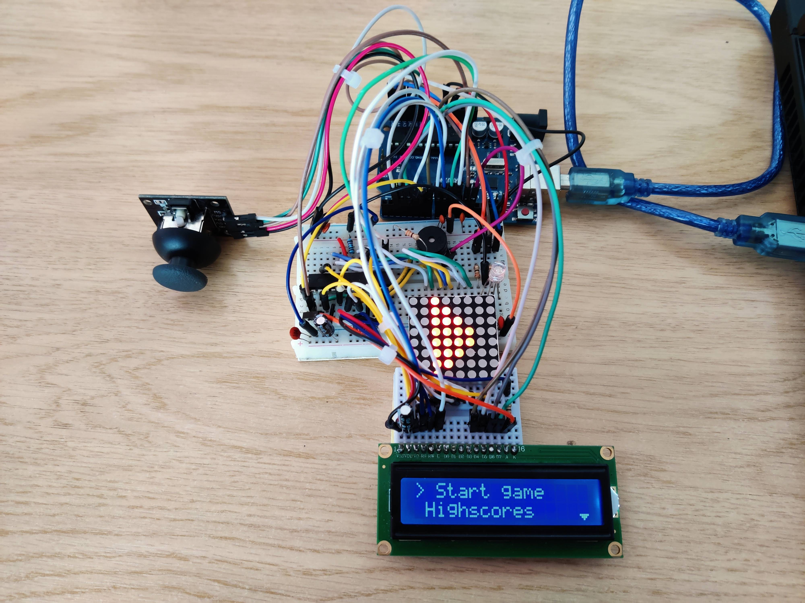

# Pixel Quest

I chose to create "Pixel Quest" for the Introduction to Robotics course to integrate hardware and software skills, drawing inspiration from classic arcade games.

## Game description

Pixel Quest is an immersive game the tests you reflexes. Navigate a 16x16 map on an 8x8 LED matrix with a joystick while collecting coins and dodging bombs. An external RGB LED provides crucial visual cues and buzzer complements the gameplay experience by providing auditory feedback.

The LCD screen provides information during the game and a menu interface where players can access highscores, adjust difficulty settings, control the brightness of the LED matrix and LCD, toggle sound, and find information about the game.

## How to play

The player is identified on the matrix by the fast blinking LED. You can move up, down, left or right using the joystick. You can break walls by facing that wall and holding the joystick button for 1 second.

The slow blinking LEDs can be either coins or bombs. To find out what they actually are you have to go next to them and the external RGB LED will light up with the following meanings:

1. Solid green. You are next to a coin. Quickly press the joystick button to collect the coin, earning 10 points, or it will disappear.
2. Blinking red. You are next to a bomb. Run before it explodes or you will die.
3. Blinking red and blue. You are next to a bomb. Run before it explodes or hold the joystick button for 1 second to defuse it, earning 50 points.

The game finishes either when you die or when you collect all coins on the map.

## Menu structure

- Start game
- Highscores - See the top 3 scores that were achieved
- Settings
	- Difficulty - Set the difficulty of the game
		- Easy - Bombs explode and coins disappear after 2 seconds
		- Medium - Bombs explode and coins disappear after 1 seconds
		- Hard - Bombs explode and coins disappear after 0.5 seconds
	- LCD
		- Contrast - Set LCD contrast (0 - 180)
		- Brightness - Set LCD brightness (0 - 255)
	- Matrix - Set matrix brightness (0 - 15)
	- Sound ON/OFF - Toggle sound on or off
	- Reset data - Delete the saved highscores
- About - Some information about the game
- How to play - Short instruction list for playing the game

## Components used

- Arduino Uno
- Breadboard
- Wires
- 1088AS 8x8 LED matrix
- MAX7219 LED Driver
- 16x2 LCD display
- Joystick
- RGB LED
- Buzzer
- Resistors
	- 5x220Ω for the RGB LED, buzzer and LCD backlight
	- 10KΩ for the LED driver
- Capacitors (for reducing noise)

## Picture of the setup

## Video

